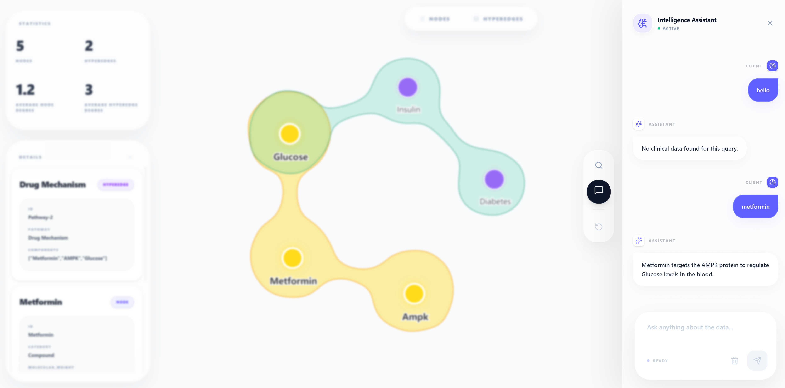
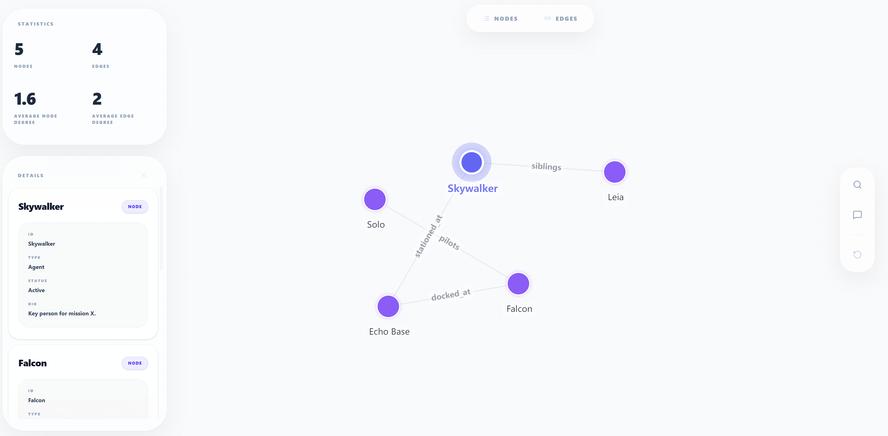
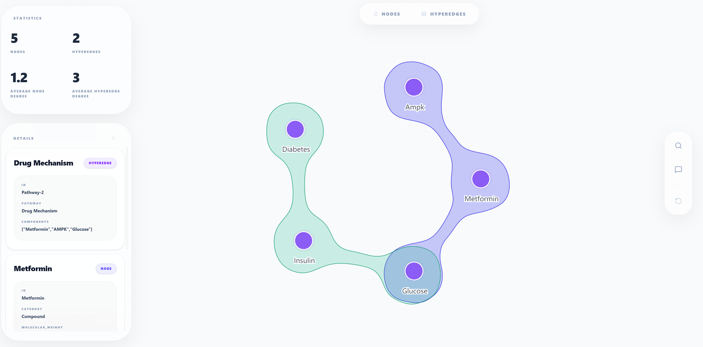
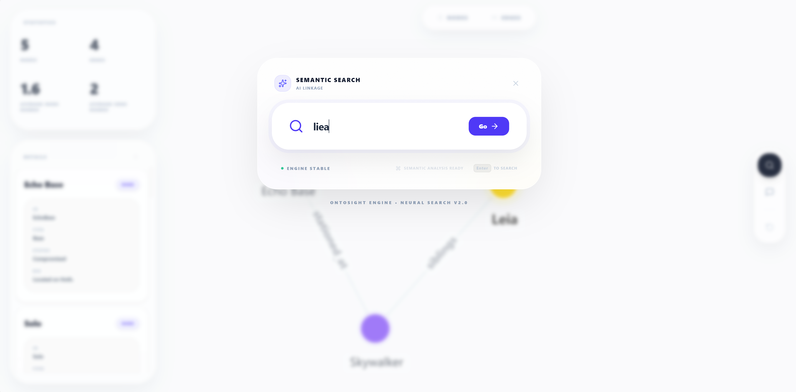
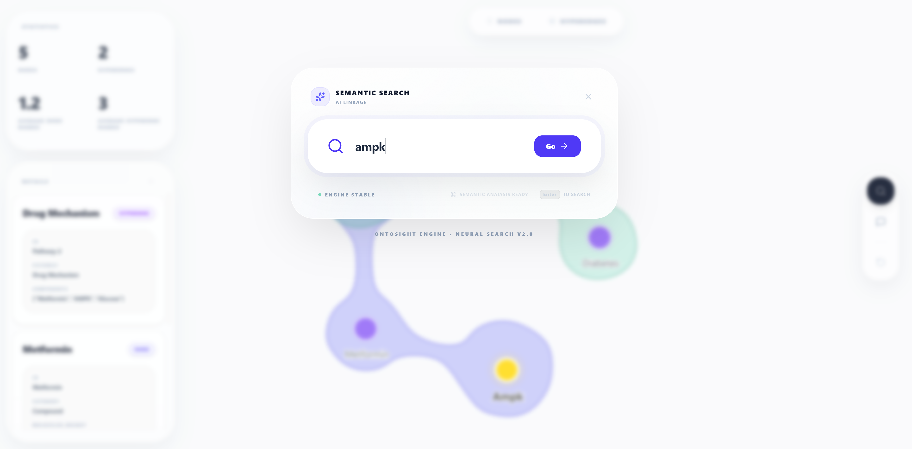
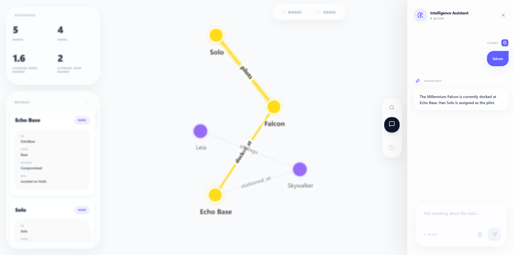

# OntoSight 🔍

<p align="center">
  
</p>

<p align="center">
  <a href="https://pypi.org/project/ontosight/"></a>
  <a href="https://python.org"></a>
  <a href="LICENSE"></a>
  <a href="#"></a>
</p>

<p align="center">
  <a href="README.md">English</a> | <b>简体中文</b>
</p>

**AI 赋能的交互式知识图谱与超图可视化引擎**

OntoSight 是一个轻量且强大的 Python 库，旨在消除静态图谱可视化与动态 AI 探索之间的隔阂。它允许开发者仅用几行代码，就为复杂的知识结构创建高度交互、可搜索、可对话的可视化界面。

---

## 🌟 核心特性

- **三种可视化模式**：
  - **图** (`view_graph`)：用于二元关系的传统节点-边网络
  - **超图** (`view_hypergraph`)：用于多元关系和复杂路径
  - **节点** (`view_nodes`)：纯实体集合 - 无边，适合档案库、语义空间和聚类展示
- **AI 友好的扩展性**：通过灵活的 `on_search` 和 `on_chat` 回调，轻松对接任何大模型 (GPT-4, Claude, Llama 3) 或向量数据库 (Milvus, Pinecone, Chroma)。
- **交互式探索**：内置属性详情面板、过滤功能以及实时节点高亮显示。
- **架构无关**：支持任何数据源。使用 Pydantic 定义 Schema，剩下的交给 OntoSight。
- **开发者至上**：原生 Python API，自动管理 Web 服务器并启动浏览器。

---

## 📸 可视化预览

### 1. 核心可视化类型
OntoSight 通过统一的接口支持图、超图和纯节点集合。

**标准图** (二元关系) | **超图** (多元关系) | **节点** (实体集合)
:---: | :---: | :---:
 |  | 档案库、语义空间、聚类展示

### 2. 智能搜索 (对接向量数据库)
定义自定义搜索回调，通过 Embedding 检索在图谱中实现“指哪亮哪”。

| 图内搜索 | 超图内搜索 |
| :---: | :---: |
|  |  |

### 3. GraphRAG 与 AI 对话
将图谱与 LLM 深度融合。在生成文本答案的同时，自动高亮显示相关的实体上下文。

| AI 对话 (图谱) | AI 对话 (超图) |
| :---: | :---: |
|  |  |

---

## 🚀 快速上手

### 安装

```bash
pip install ontosight
```

### 基础用法 - 图谱

使用 Pydantic 模型定义你的数据结构：

```python
from pydantic import BaseModel
from ontosight import view_graph

class Entity(BaseModel):
    name: str
    type: str

class Relation(BaseModel):
    source: str
    target: str
    relation: str

# 准备数据
nodes = [Entity(name="Alice", type="Person"), Entity(name="Wonderland", type="Place")]
edges = [Relation(source="Alice", target="Wonderland", relation="visits")]

# 启动可视化
view_graph(
    node_list=nodes,
    edge_list=edges,
    node_schema=Entity,
    edge_schema=Relation,
    node_id_extractor=lambda n: n.name,
    node_ids_in_edge_extractor=lambda e: (e.source, e.target),
    edge_label_extractor=lambda e: e.relation
)
```

### 基础用法 - 纯节点

用于可视化没有边的实体集合：

```python
from pydantic import BaseModel
from ontosight import view_nodes

class Recipe(BaseModel):
    name: str
    cuisine: str
    difficulty: str

# 准备数据
recipes = [
    Recipe(name="意大利面", cuisine="意大利", difficulty="简单"),
    Recipe(name="点心", cuisine="中国", difficulty="中等"),
]

# 启动可视化
view_nodes(
    node_list=recipes,
    node_schema=Recipe,
    node_id_extractor=lambda r: r.name,
    node_label_extractor=lambda r: r.name,
)
```

---

## 🧠 AI 融合 (OntoSight 的核心灵魂)

OntoSight 为 AI 时代而生。虽然我们没有内置特定的 LLM，但我们提供了完美的“管道”，让你的图谱变得智能且可交互。

### 灵活搜索 (对接向量数据库)
你可以定义自定义搜索回调，利用 Embedding 模型进行语义搜索，快速定位子图。

```python
def my_vector_search(query: str):
    # 调用你的向量数据库逻辑 (例如 Milvus)
    # 返回匹配的节点和边列表
    pass

view_graph(..., on_search=my_vector_search)
```

### 图谱问答 (GraphRAG)
将聊天界面直接连接到图谱。当用户提出问题时，大模型在生成文本答案的同时，OntoSight 会自动在图谱中高亮显示相关的知识子图。

```python
def my_chat_handler(question: str):
    # 1. 将问题发送给 LLM (如 GPT-4)
    # 2. 从检索逻辑中获取相关的节点和边
    return "爱丽丝正在奇境中冒险。", (relevant_nodes, relevant_edges)

view_graph(..., on_chat=my_chat_handler)
```

---

## 🛠 高级功能

- **Schema 驱动的详情面板**：基于 Pydantic 模型自动生成 UI 面板。
- **超图建模支持**：可视化多个实体之间复杂的高阶关系。

---

## 📄 开源协议
OntoSight 基于 [Apache License 2.0](LICENSE) 协议发布。
